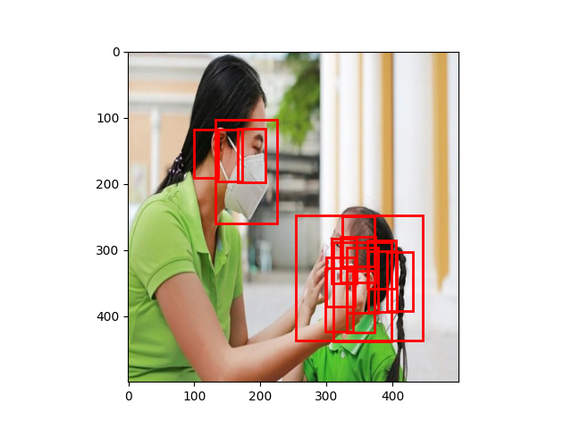
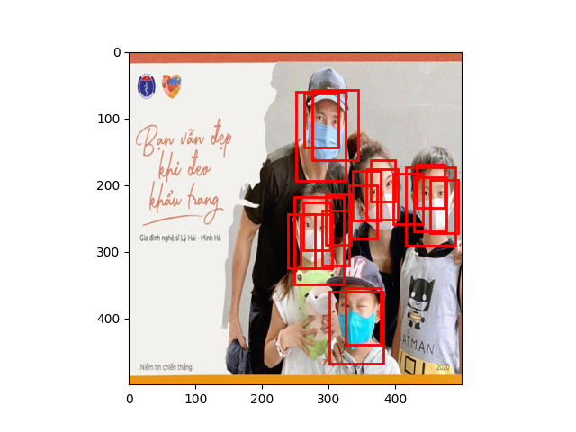

# Region-Proposal-Network-Tensorflow
The repository is used to implement a Region Proposal Network (RPN) in Faster R-CNN

## 1. Requirement
* Python :[3.10](https://www.python.org/downloads/release/python-31016/)
* Tensorflow 2.17.1: needed CUDA.
* IDE: Pycharm.

## 2. Data Preparation

I get data from Kaggle. This is a dataset of approximately 800 images of wearing masks, not wearing masks, and wearing masks improperly.
You can get data From [Here](https://www.kaggle.com/datasets/andrewmvd/face-mask-detection). Pleased see [example](https://github.com/thanhhoai2k4/Region-Proposal-Network-Tensorflow/tree/main/data_training).

## 3. Create environment

in Current Path, you install package:

    `pip install -r requirements.txt`

## 4.Training with tensorflow.

"Training_Cache.py" : this is training file with a small dataset.

"Trainning_Generator.py" : this is training file using [tf.Data](https://www.tensorflow.org/api_docs/python/tf/data/Dataset) is parallel load.

"Trainning_pre.py" : this is pre-Training.

## 5. Result.

The results are quite good compared to expectations.

## 5. Advance

Combine with a new model to predict which class the proposed box belongs to => Faster R-CNN.
Faster R-CNN is  two stage detector with region proposal and classification network.

Good luck.

## 6.reference

[Faster R-CNN Tran Van huy](https://huytranvan2010.github.io/Faster-RCNN/)

[Understanding and Implementing Faster R-CNN: A Step-By-Step Guide](https://medium.com/towards-data-science/understanding-and-implementing-faster-r-cnn-a-step-by-step-guide-11acfff216b0)

[Faster R-CNN step by step, Part I](https://dongjk.github.io/code/object+detection/keras/2018/05/21/Faster_R-CNN_step_by_step,_Part_I.html)
